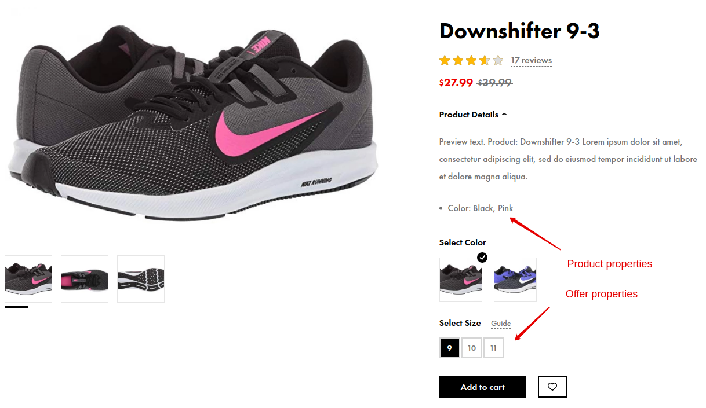

# Designing of catalog structure

Designing catalog structure is **very important stage before development** of our project.
It is very important at this stage to determine what will be product and what will be offer in your catalog,
what will be category and what will be tag in your catalog,
what will be product property and what will be offer property in your catalog.

> Site design greatly affects the catalog structure.

## Step 1: Products and offers

You need to determine what your project will be зкщвгсеы and what will be offers. This is very important decision. Product can not be bought or put in basket.

Product page design should be contain block with offer list. If product page is no offer choice in your project, then you need to create only one offer for each product.

You need to take into account SEO requirements for your project.

```plantuml
@startuml
[Catalog of smartphones]

node "Products" {
    [iPhone X Black]
    [iPhone X White]
}

node "Offres" {
    [iPhone X Black 64Gb]
    [iPhone X Black 128Gb]
    [iPhone X White 64Gb]
    [iPhone X White 128Gb]
}

[Catalog of smartphones] --> [iPhone X Black]
[Catalog of smartphones] --> [iPhone X White]

[iPhone X Black] --> [iPhone X Black 64Gb]
[iPhone X Black] --> [iPhone X Black 128Gb]
[iPhone X White] --> [iPhone X White 64Gb]
[iPhone X White] --> [iPhone X White 128Gb]

note right of [Catalog of smartphones]
  Product is smartphone model.
  Offer is smartphone model
  with different storage capacity.
end note
@enduml
```
```plantuml
@startuml
[Catalog of sneakers]

node "Products" {
    [Downshifter Black]
    [Downshifter White]
}

node "Offres" {
    [Downshifter Black - size 10]
    [Downshifter Black - size 12]
    [Downshifter White - size 10]
    [Downshifter White - size 12]
}

[Catalog of sneakers] --> [Downshifter Black]
[Catalog of sneakers] --> [Downshifter White]

[Downshifter Black] --> [Downshifter Black - size 10]
[Downshifter Black] --> [Downshifter Black - size 12]
[Downshifter White] --> [Downshifter White - size 10]
[Downshifter White] --> [Downshifter White - size 12]

note right of [Catalog of sneakers]
  Product is sneakers model.
  Offer is sneakers model
  with different sizes.
end note
@enduml
```

```plantuml
@startuml
[Catalog of flowers]

node "Products" {
    [Rose Red - 30cm]
    [Rose Red - 50cm]
    [Rose White - 30cm]
    [Rose White - 50cm]
}

node "Offres" {
    [Rose Red - 30]
    [Rose Red - 50]
    [Rose White - 30]
    [Rose White - 50]
}

[Catalog of flowers] --> [Rose Red - 30cm]
[Catalog of flowers] --> [Rose Red - 50cm]
[Catalog of flowers] --> [Rose White - 30cm]
[Catalog of flowers] --> [Rose White - 50cm]

[Rose Red - 30cm] --> [Rose Red - 30]
[Rose Red - 50cm] --> [Rose Red - 50]
[Rose White - 30cm] --> [Rose White - 30]
[Rose White - 50cm] --> [Rose White - 50]

note right of [Catalog of flowers]
  Product is flowers with different colors and height.
  Products have only one offer.
end note
@enduml
```

## Step 2: Related products

Perhaps your catalog has similar products, but you need to display them on separate pages. You need to use ["Related products for Shopaholic"](plugins/home.md#related-products-for-shopaholic) plugin to add relation between products.

## Step 3: Category and tags

You need to determine what in your catalog tree will be category and what will be tag.
Tag page is seo page with unique title and description.
Tag page should not be displayed in breadcrumbs on product page.

For example: "Hot Summer" and "Spring mood" are tags.
```plantuml
@startmindmap
* Catalog
** For men
*** Shirts
*** T-shirts
****_ Hot Summer
****_ Spring mood
*** Pants
** For women
*** Shirts
*** T-shirts
****_ Hot Summer
****_ Spring mood
*** Pants
** For children
*** For boys
**** Shirts
**** T-shirts
**** Pants
*** For girls
**** Shirts
**** T-shirts
**** Pants
@endmindmap
```

## Step 4: Product and offer properties

You need to associate properties: with products or offers.

