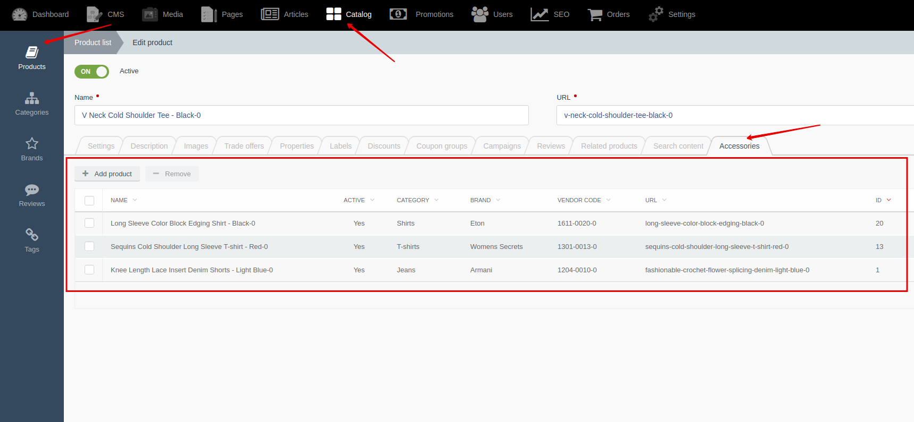

# Accessory {docsify-ignore-all}

[Back to modules](modules/home.md)

!> **Attention!**  We recommend that you read [Architecture](home.md#architecture), [ElementItem class](item-class/item-class.md),
[ElementCollection class](collection-class/collection-class.md) sections for complete understanding of  project architecture.

## Introduction

Accessory block usually looks like list of products on main product page.

> Accessories do not depend on product categories.

```plantuml
@startuml
[Main products]

node "Smartphones" {
    [iPhone X]
    [Samsung S10]
}

node "Computers" {
    [Computer Model X2S]
    [Computer Model X4L]
}

node "Accessories" {
    [Headphones ER35]
    [Keyboard LL22Z]
}

[Main products] --> [iPhone X]
[Main products] --> [Samsung S10]
[Main products] --> [Computer Model X2S]
[Main products] --> [Computer Model X4L]

[iPhone X] --> [Headphones ER35]
[Samsung S10] --> [Headphones ER35]
[Computer Model X2S] --> [Headphones ER35]
[Computer Model X4L] --> [Headphones ER35]

[Computer Model X2S] --> [Keyboard LL22Z]
[Computer Model X4L] --> [Keyboard LL22Z]

note bottom of [Headphones ER35]
  This product is accessory for products
  from different categories.
end note
@enduml
```

## Backend

You can attach products as accessories by going to **Backend -> Catalog -> Products -> Edit product -> "Accessories" tab**

[Back to modules](modules/home.md)