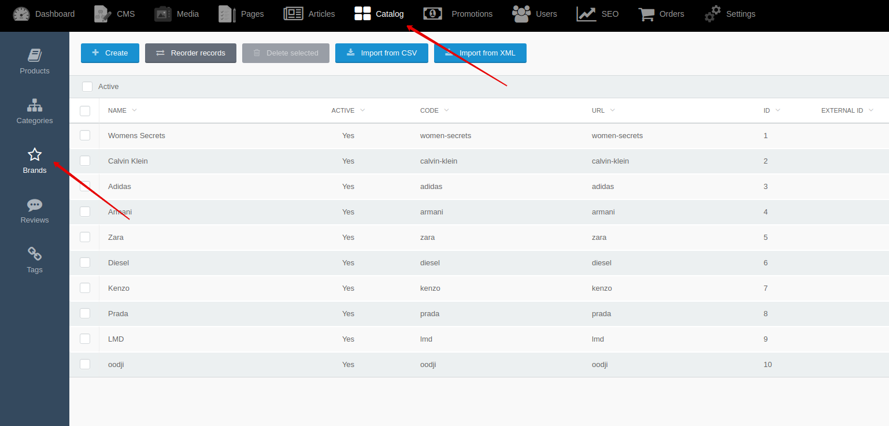
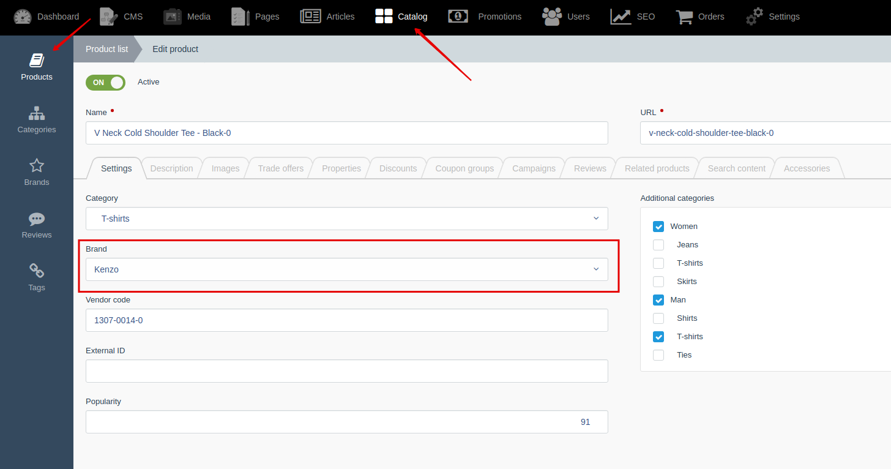
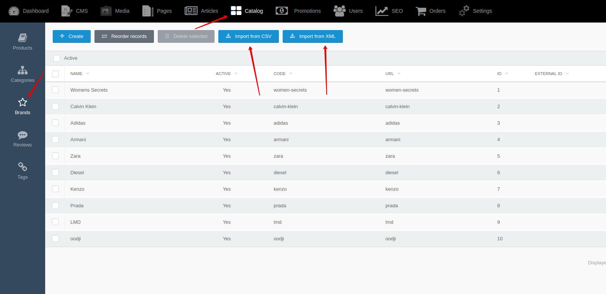

[Back to modules](modules/home.md)

Home
• [Model](modules/brand/model/model.md)
• [Item](modules/brand/item/item.md)
• [Collection](modules/brand/collection/collection.md)
• [Components](modules/brand/component/component.md)
• [Events](modules/brand/event/event.md)
• [Examples](modules/brand/examples/examples.md)
• [Extending](modules/brand/extending/extending.md)

# Brand {docsify-ignore-all}

!> **Attention!**  We recommend that you read [Architecture](architecture/architecture), [ElementItem class](architecture/item-class/item-class.md),
[ElementCollection class](architecture/collection-class/collection-class.md) sections for complete understanding of  project architecture.

## Backend

You can create and edit brands by going to **Backend -> Catalog -> Brands**

You can change sorting of brands by going to **Backend -> Catalog -> Brands -> Reorder records**

You can attach one brand to product

## Import

You can import brands from XML and CSV files.
You can use [events](modules/brand/event/event#event-list-brand), that allows you to extend import data.
 
> You can learn more about importing from [XML](import/import-from-xml/home.md#import-from-xml) and [CSV](import/import-from-csv/home.md#import-from-csv) files in [section](import/import-from-xml/home.md#import-from-xml).

Home
• [Model](modules/brand/model/model.md)
• [Item](modules/brand/item/item.md)
• [Collection](modules/brand/collection/collection.md)
• [Components](modules/brand/component/component.md)
• [Events](modules/brand/event/event.md)
• [Examples](modules/brand/examples/examples.md)
• [Extending](modules/brand/extending/extending.md)

[Back to modules](modules/home.md)
