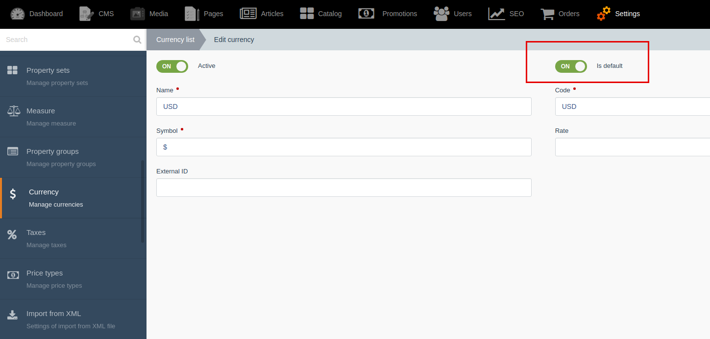

# Currency {docsify-ignore-all}

[Back to modules](modules/home.md)
/ Home
/ [Model](modules/currency/model/model.md)
/ [Item](modules/currency/item/item.md)
/ [Collection](modules/currency/collection/collection.md)
/ [Components](modules/currency/component/component.md)
/ [Examples](modules/currency/examples/examples.md)
/ [Extending](modules/currency/extending/extending.md)
/ [Advanced usage](modules/currency/advanced-usage/home.md)

!> **Attention!**  We recommend that you read [Architecture](home.md#architecture), [ElementItem class](item-class/item-class.md),
[ElementCollection class](collection-class/collection-class.md) sections for complete understanding of  project architecture.

## Backend

You can create and edit currency by going to **Backend -> Settings -> Currency**


You can set one of currencies as default currency.

!> **Attention!** All offer prices must be set in default currency.



**"Symbol"** field is used to render currency symbol on your site (For example: "$").
**"Code"** field is used to render international currency code in meta tags (For example: "USD").

Example:
```twig
Example:
<span itemprop="priceCurrency" content="{{ obOffer.currency_code }}">
    {{ obOffer.currency }}
</span>

Result:
<span itemprop="priceCurrency" content="USD">$</span>
```

You can change sorting of currencies by going to **Backend -> Settings -> Currencies -> Reorder records**


[Back to modules](modules/home.md)
/ Home
/ [Model](modules/currency/model/model.md)
/ [Item](modules/currency/item/item.md)
/ [Collection](modules/currency/collection/collection.md)
/ [Components](modules/currency/component/component.md)
/ [Examples](modules/currency/examples/examples.md)
/ [Extending](modules/currency/extending/extending.md)
/ [Advanced usage](modules/currency/advanced-usage/home.md)