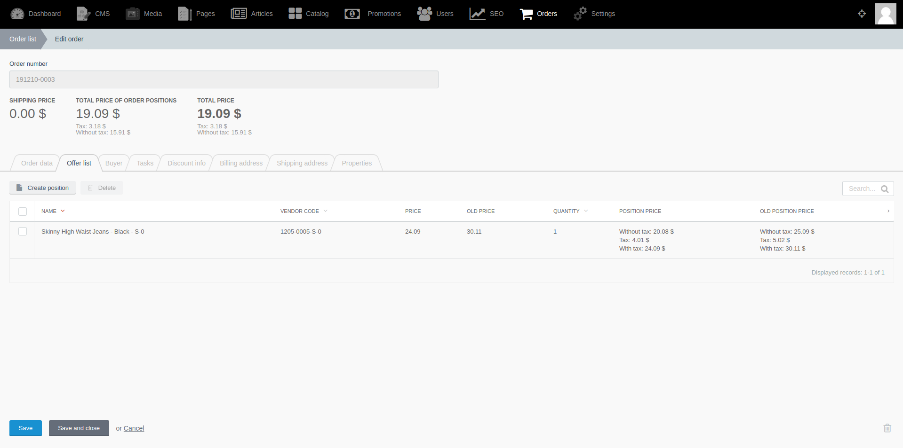

[Back to modules](modules/home.md)

Home
• [Model](modules/order-position/model/model.md)
<!--
• [Item](modules/order-position/item/item.md)
• [Collection](modules/order-position/collection/collection.md)
• [Components](modules/order-position/component/component.md)
• [Events](modules/order-position/event/event.md)
• [Examples](modules/order-position/examples/examples.md)
• [Extending](modules/order-position/extending/extending.md)
-->

# Order position {docsify-ignore-all}

!> **Attention!**  We recommend that you read [Architecture](home.md#architecture), [ElementItem class](item-class/item-class.md),
[ElementCollection class](collection-class/collection-class.md) sections for complete understanding of  project architecture.

> Module available with [Orders for Shopaholic](plugins/home#orders-for-shopaholic) plugin.

Order positions contain relationship between the order and the offers that the user added to cart when creating the order.
When creating an order, the offer price is saved in the order position.
The order position contains the offer price without any discounts in database.

## Backend

You can create and edit orders and order positions by going to **Backend -> Orders**

Home
• [Model](modules/order-position/model/model.md)
<!--
• [Item](modules/order-position/item/item.md)
• [Collection](modules/order-position/collection/collection.md)
• [Components](modules/order-position/component/component.md)
• [Events](modules/order-position/event/event.md)
• [Examples](modules/order-position/examples/examples.md)
• [Extending](modules/order-position/extending/extending.md)
-->

[Back to modules](modules/home.md)
