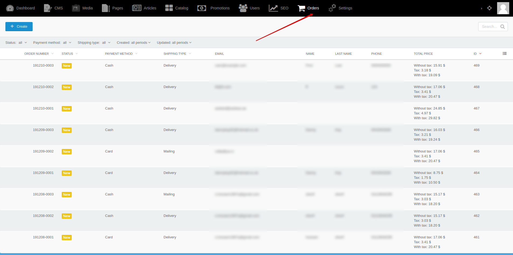
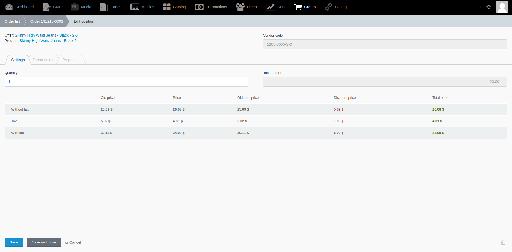

[Back to modules](modules/home.md)

Home
• [Model](modules/order/model/model.md)
• [Item](modules/order/item/item.md)
• [Collection](modules/order/collection/collection.md)
• [Components](modules/order/component/component.md)
• [Events](modules/order/event/event.md)
• [Examples](modules/order/examples/examples.md)
• [Extending](modules/order/extending/extending.md)

# Order {docsify-ignore-all}

!> **Attention!**  We recommend that you read [Architecture](home.md#architecture), [ElementItem class](item-class/item-class.md),
[ElementCollection class](collection-class/collection-class.md) sections for complete understanding of  project architecture.

Order is one of main entities in your project.
Order has complex logic.
Before developing your project, you need to determine flow
through which user will go before purchase and how order will be changed according to status scheme after purchase.

For example, your flow might be like this:

```plantuml
@startuml
start
:User adds products to cart;
:User goes to checkout page;
:User changes cart positions,
removes positions, changes quantity;
:User adds coupon to cart;
:User fills in their contact details;
:User chooses payment method;
:User chooses shipping type;
:User fills shipping and billing adresses;
:User makes order;
if (Need redirect to payment gateway?) then (yes)
    :User goes to payment gateway;
    :User pays with using payment gateway;
else (no)
endif
:Redirecting user to "Thank You" page;
:Site sends mails to user and manager;
:Manager changes order status;
:User sees changes of order status
in his account or receiving emails; 
stop
@enduml
```

## Backend

You can create and edit orders by going to **Backend -> Orders**

Home
• [Model](modules/order/model/model.md)
• [Item](modules/order/item/item.md)
• [Collection](modules/order/collection/collection.md)
• [Components](modules/order/component/component.md)
• [Events](modules/order/event/event.md)
• [Examples](modules/order/examples/examples.md)
• [Extending](modules/order/extending/extending.md)

[Back to modules](modules/home.md)
